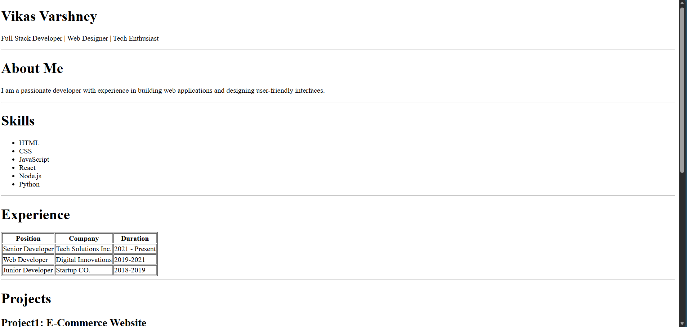
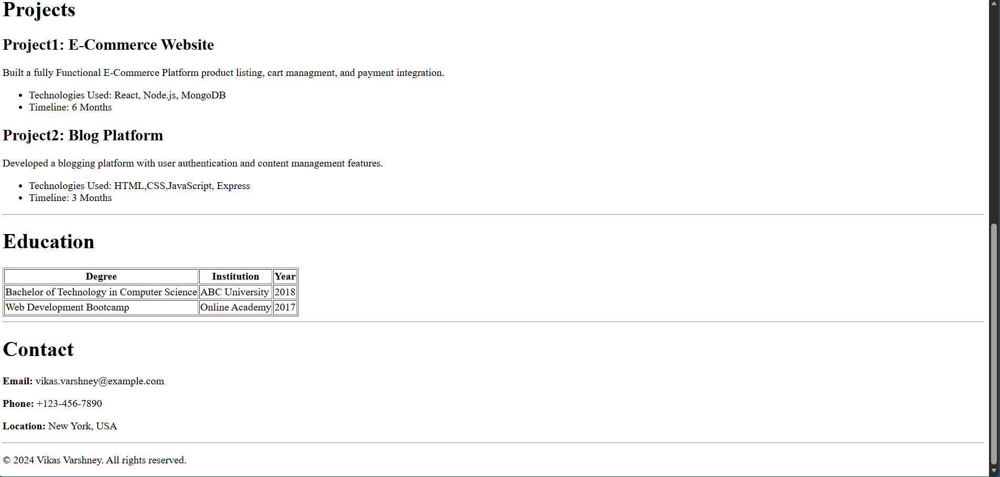

# HTML Resume Template

A simple, clean, and responsive **HTML resume template** built using pure **HTML**.  
This project is designed to be lightweight, easy to customize, and suitable for quick deployment using **GitHub Pages**.

---

## Demo

🔗 **Live Demo:**  
https://vikasvarshney01.github.io/HTML-Resume/

> The resume template is deployed using GitHub Pages for easy access and evaluation.

---

##  Tech Stack

- HTML5  
---

##  Project Structure

HTML-Resume/
│── index.html


---

##  Setup Instructions

Follow these steps to run the project locally:

1. Clone the repository:
   ```bash
   git clone https://github.com/vikasvarshney01/HTML-Resume.git
Navigate into the project folder:

cd HTML-Resume
Open index.html in your browser


Screenshots:






👤 Author
Vikas Varshney
GitHub: https://github.com/vikasvarshney01


-


